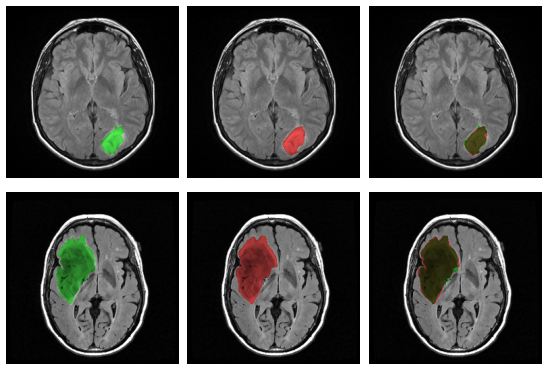
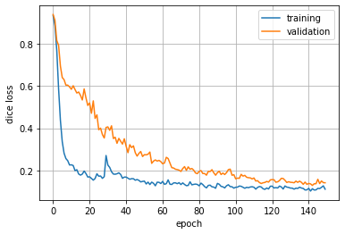

    

# Brain-MRI-segmentation
Tumor segmentation in brain MRI using U-Net \[1\] optimized with the Dice Loss \[2]. The dataset is available from this [repository](https://github.com/giacomodeodato/BrainMRIDataset).

Below are displayed the training curves of the U-Net with 4 blocks of depth, with a fixed number of hidden features equal to 32. The model has been optimized using Adam with a learning rate of 1e-4 for 150 epochs and a learning rate step with gamma = 0.1 at epoch 30. The training code is available in this [notebook](https://github.com/giacomodeodato/Brain-MRI-segmentation/blob/main/BrainMRISegmentation/Brain_MRI_Segmentation.ipynb).

    

## `UNet.py`

## `DiceLoss.py`
The Dice Loss is a criterion for image segmentation that uses the Sørensen–Dice coefficient between the true segmentation mask and the predicted one \[2\]. It is implemented as follows:

    

## `MRIDataset.py`
The MRIDataset class is a simple interface for the Dataset class from [brainMRI](https://github.com/giacomodeodato/BrainMRIDataset/tree/main/brainMRI) to be compatible with pytorch DataLoader.

## References
\[1\] **\[Ronneberger, Fischer, & Brox, 2015\]** "U-net: Convolutional networks for biomedical image segmentation". *International Conference on Medical image computing and computer-assisted intervention*.

\[2\] **\[Milletari, Navab, & Ahmadi, 2016\]** "V-net: Fully convolutional neural networks for volumetric medical image segmentation". *International Conference on 3D Vision*.
